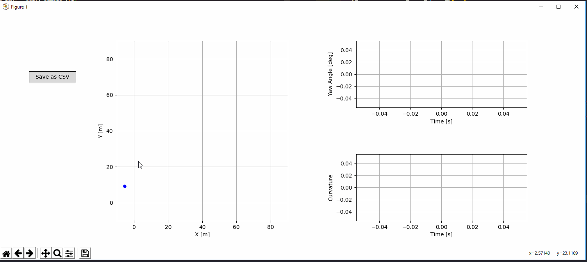
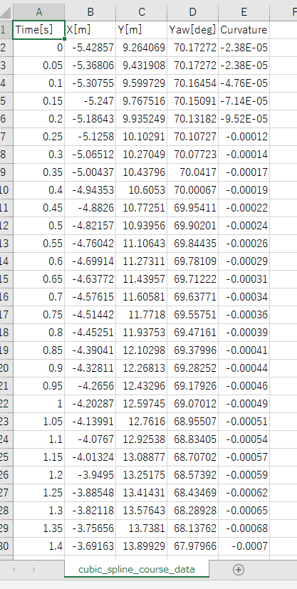

# CubicSplineCourseGenerator
---
Python GUI tool for generating a course data by cubic spline function.

## Author
---
Shisato Yano

## Dependency
---
Python 3.6.x
matplotlib
pandas
numpy

## Usage
---
1. Start application: python cubic_spline_course_generator.py
2. Select a sample point on left side, X-Y plot axes.
3. When more than 2 sample points were selected, these points will be interpolated by cubic spline.
4. Generated cubic spline course are plot on left side, X-Y plot axes.
5. The yaw angle[deg] are plot on upper right side, Time-Yaw angle plot axes.
6. The curvature are plot on lower right side, Time-Curvature plot axes.
7. Generated course data can be exported as csv file by pushing the left side button "Save as CSV".

## Exported CSV file sample
---

